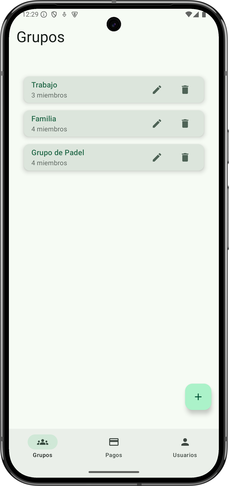
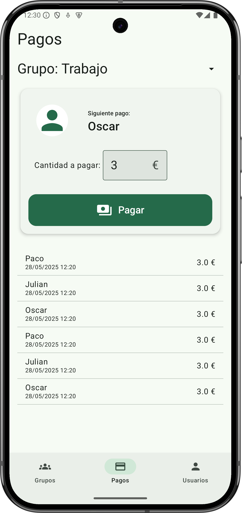
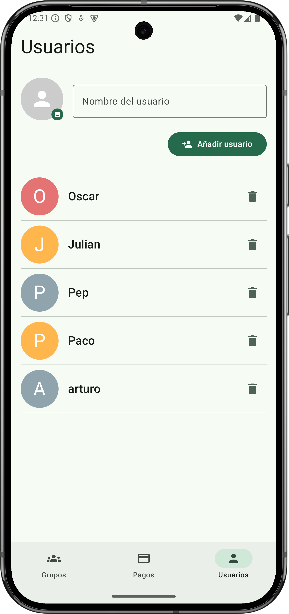

# 💸 PayPals

Aplicación Android nativa desarrollada con **Jetpack Compose**, diseñada para organizar los turnos de pago cuando sales a tomar algo con tus amigos.

---

## 🧰 Tecnologías y librerías usadas

### 🏗️ Arquitectura
- Clean Architecture (data / domain / ui)
- MVVM (Model-View-ViewModel)
- Hilt (inyección de dependencias)
- Room (base de datos local)
- Kotlin Coroutines y Flow

### 🎨 Interfaz
- Jetpack Compose
- Material 3 (Material You)
- Navigation Compose
- Accompanist FlowLayout
- Coil (carga de imágenes)

### ⚙️ Herramientas
- Gradle Version Catalog
- Kotlin 2.0.0

---

## 🚀 Estado del proyecto

La aplicación se encuentra en **versión beta**.  
Actualmente incluye:
- Creación y gestión de grupos y usuarios
- Selección de miembros
- Sistema básico de pagos por turnos

Próximas funcionalidades previstas:
- [ ] Historial completo de pagos editable
- [ ] Notificaciones push

---

## 🖼️ Capturas de pantalla

| Grupos | Pagos | Usuarios |
|:--:|:--:|:--:|
|  |  |  |

---

## 👨‍💻 Autor
 
🔗 [https://github.com/Osovan](https://github.com/Osovan)